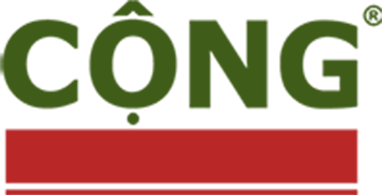

<p align="center">
  
</p>

# CongCafe
### Introduction

* The story of Cong began in 2007. The first shop of the franchise was a small café, situated on Trieu Viet Vuong street – the historic café street of Hanoi.
* The name “Cộng” is simply taken from the first word of Vietnam’s official name: CỘNG HOÀ XÃ HỘI CHỦ NGHĨA VIỆT NAM (The Socialist Republic of Vietnam).
* We are totally in love with CongCafe, so we decide to clone CongCafe's website for this project

### Objectives
* Featured theme, easy to use

## Table Content
* [Introduction](#introduction)
* [Technologies](#technologies)
* [Getting Started](#getting-started)
* [Source](#source)

## Technologies
* Backend : PHP
* Frontend : HTML, CSS, JavaScript, Bootstrap, JQuery
* Additional library: React, React-router-dom, React-helmet,

## Getting Started
You have to download and install npm & Node.js before going to setup Yarn

### Yarn  [](https://github.com/yarnpkg/yarn) [](https://www.npmjs.com/) [](https://www.npmjs.com/)
```
npm install yarn
```

### You have to start 2 server for server and client
#### Server
```
cd server
npm install 
npm start
```

#### Client
```
cd client
yarn
yarn start
```

## Source
https://congcaphe.com/
